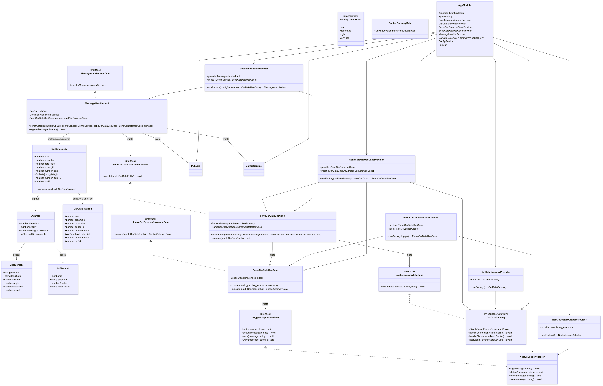

# Diagrama de Classes

É uma representação visual das **classes** do sistema, especificando seus atributos, métodos e os relacionamentos entre elas. É utilizado para modelar a estrutura estática do sistema, oferecendo assim uma visão geral da arquitetura do mesmo.

