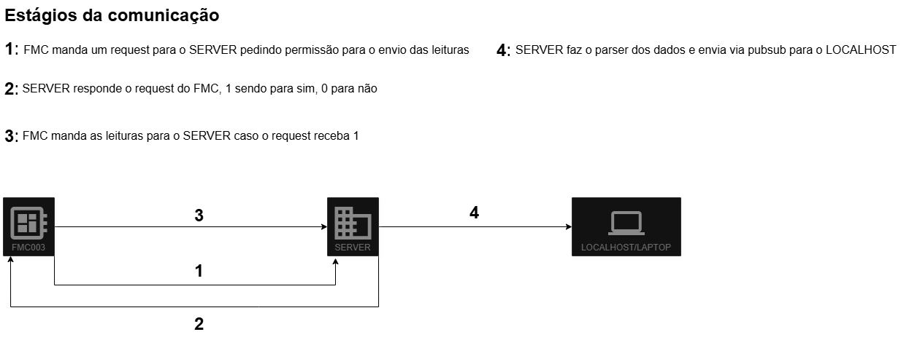

# Diagrama de rede

Trata-se de uma representação gráfica da **topologia da rede**, descrevendo as conexões entre os dispositivos, seja conexões físicas (cabos) ou lógicas (redes sem fio). Permitindo assim uma melhor vizualização da estrutura da rede, facilitando o entendimento, planejamento e gerenciamento do sistema.

